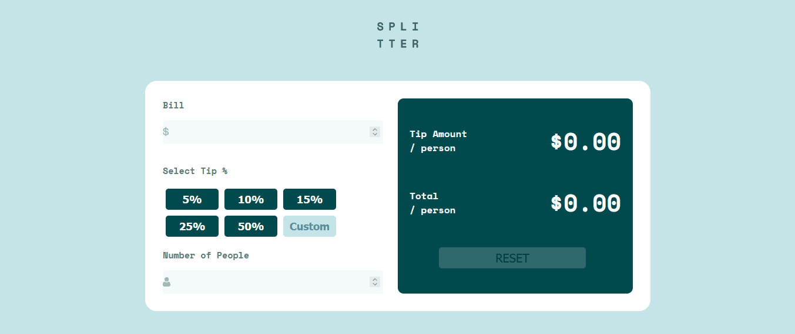

# Frontend Mentor - Tip calculator app

## Sumário

- [Visão geral](#visão-geral)
  - [Nota](#Nota)
  - [O Desafio](#o-desafio)
  - [Screenshot](#screenshot)
- [Links](#links)
- [Meu processo](#meu-processo)
  - [Tecnologias](#tecnologias-usadas)
  - [O que eu aprendi](#o-que-aprendi)
  - [Dificuldades](#dificuldades)
- [Contato](#contato)

## Visão Geral

### Nota
Por se tratar de um desafio de um site em inglês resolvi codar em inglês, para praticar e manter o costume deste idioma. 

### O Desafio
      O desafio consiste em construir uma calculadora de gorjetas e fazê-la parecer o mais próximo possível do design.

Os usuários devem ser capazes de:

- Interagir com o layout ideal para o aplicativo, dependendo do tamanho da tela do dispositivo;
- Interagir com os estados de hover e foco para todos os elementos interativos na página;
- Calcular a gorjeta correta e o custo total da conta por pessoa.

### Screenshot

## Links

- Repositório: 
- Deploy: 

## Meu Processo

### Tecnologias usadas:

- HTML5 Semântico
- CSS3 responsivo
- Flexbox
- Grid
- Javascript 

### O que aprendi?

Pude consolidar ainda mais meus conhecimentos em HTML semântico, o poder das grouping tags de facilitarem a estruturação do projeto, links posicionados de forma semântica;  
Também o CSS responsivo com Media Queries para gerar uma melhor experiência para o usuário, independendo do dispositivo. Flexbox, elementos posicionados de forma rápida e prática. Modelo de Caixas. Tipografia. Variaveis. Displays ;  
Pude também firmar mais meu conhecimento em manipulação do DOM do Javascript.  
Funções separadas, com cada uma exercendo seu papel, tornando o código mais fácil de compreender e de manutenção, contribui para uma lógica de progração mais clara.  
O método forEach, facilitou em iterar os botões e contribui com o meu entendimento da lógica do desafio.

### Dificuldades

Transpor a lógica da matemática, dos cálculos das porcentagens de cada botão, foi uma dificuldade que tive, que permeou desde o início deste projeto. Com muitos cálculos e pesquisa e testes, consegui superar isto.

## Contato

- Github - [mazziera.io](https://github.com/mazziera)
- Frontend Mentor - [@mazziera](https://www.frontendmentor.io/profile/mazziera)
- Linkedin - [@raphael-mazzieri](https://www.linkedin.com/in/raphael-mazzieri/)